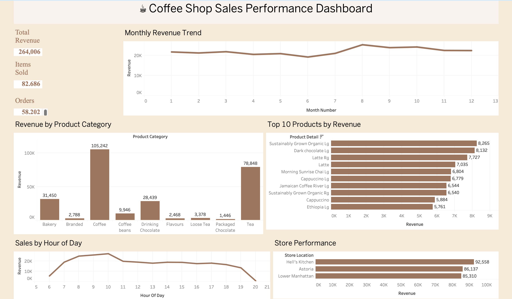

# ☕ Coffee Shop Sales Analytics Dashboard

An end-to-end sales analytics project built with **SQL Server** and **Tableau** to analyze over **58,000 coffee shop transactions**. This project demonstrates data cleaning, business KPI analysis, and interactive dashboard development to support data-driven decision-making.

---

## 📊 Dashboard Preview



---

## 📌 Project Overview

This project explores transactional sales data from a coffee shop chain to uncover insights into revenue trends, store performance, product performance, and customer purchasing behavior.

Using **SQL Server**, the raw data was cleaned, transformed, and analyzed to calculate business KPIs. The cleaned dataset was then visualized in **Tableau**, resulting in an interactive dashboard for business analysis.

---

## 🛠️ Tools & Technologies

- SQL Server
- Azure Data Studio
- Tableau Public
- Microsoft Excel

---

## 📂 Dataset

- **Records:** 58,202 transactions
- **Industry:** Coffee Shop / Retail
- **Source:** Maven Analytics Coffee Shop Sales Dataset

---

## 🔄 Project Workflow

```text
Raw Sales Data (CSV)
        ↓
SQL Server
        ↓
Data Cleaning & Transformation
        ↓
Business KPI Analysis
        ↓
Export Clean Dataset
        ↓
Tableau Dashboard
```

---

## 💼 Business Questions Answered

- Which store generates the highest revenue?
- Which product categories contribute the most revenue?
- Which products are the best sellers?
- How does monthly revenue change over time?
- What are the busiest hours of the day?

---

## 💻 SQL Skills Demonstrated

- Data Cleaning
- Data Transformation
- SQL Views
- Aggregate Functions
- GROUP BY
- ORDER BY
- Date & Time Functions
- Business KPI Calculations

---

## 📈 Dashboard Features

- 📌 Total Revenue KPI
- 📌 Total Items Sold KPI
- 📌 Total Orders KPI
- 📈 Monthly Revenue Trend
- 🏪 Revenue by Store
- ☕ Revenue by Product Category
- ⭐ Top 10 Products by Revenue
- 🕒 Sales by Hour

---

## 🔍 Key Insights

- Hell's Kitchen generated the highest total revenue among all store locations.
- Coffee products accounted for the largest share of total revenue.
- Sales peaked during the morning hours, indicating the busiest business period.
- Revenue increased during late summer before declining toward the end of the year.
- A small number of products contributed a significant portion of overall revenue.

---

## 📁 Repository Contents

```
coffee-shop-sales-dashboard/
│
├── README.md
├── coffee_dashboard.twbx
├── coffee_shop_sales_analysis.sql
├── coffee_shop_sales_clean.xlsx
└── coffeedashboard.png
```

---

## 🎯 Skills Demonstrated

- SQL
- SQL Server
- Data Cleaning
- Data Transformation
- Business Intelligence
- Tableau
- Dashboard Design
- Data Visualization
- KPI Reporting
- Retail Sales Analytics

---

## 👤 Author

**Dilly Nguyen**

Data Science Student | DePaul University
